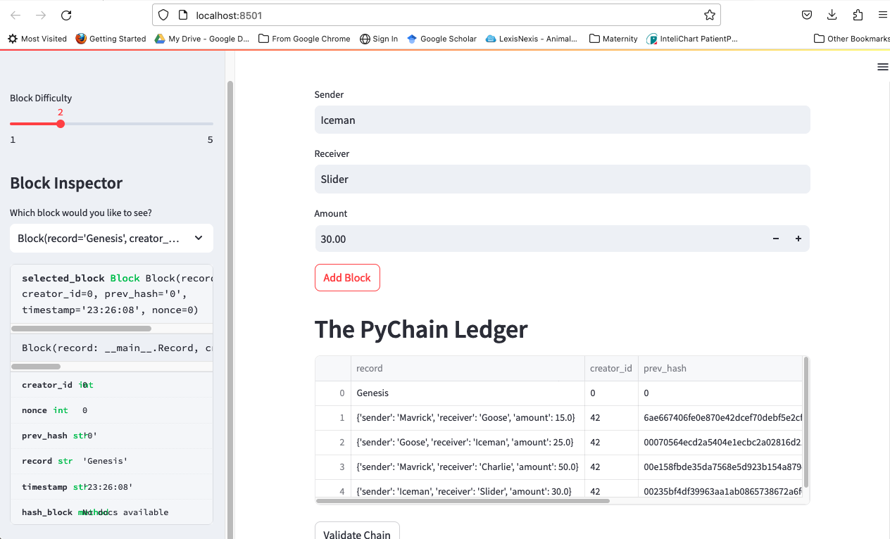
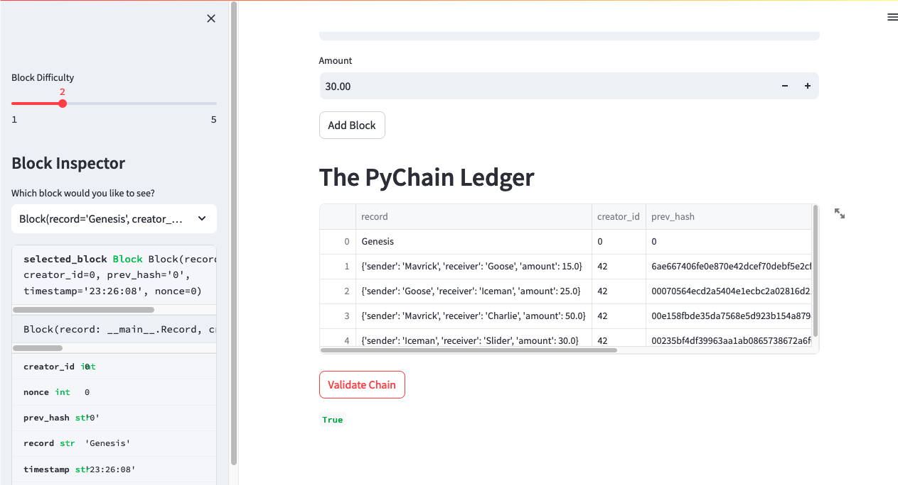

# **Columbia University Engineering, New York FinTech Bootcamp** 
# **Challenge 18 - building a blockchain-based ledger system**

Objective - to simulate fintech engineer working at a a major global bank. 

Scenario - As the lead developer of the decentralized finance team, build a blockchain-based ledger system, complete with a user-friendly web interface. This ledger should allow partner banks to conduct financial transactions (that is, to transfer money between senders and receivers) and to verify the integrity of the data in the ledger. 

What I've Created - 

>* Create a new data class named Record. This class will serve as the blueprint for the financial transaction records that the blocks of the ledger will store.
>* Change the existing Block data class by replacing the generic data attribute with a record attribute that’s of type Record. 
>* Create additional user input areas in the Streamlit application. These input areas should collect the relevant information for each financial record that you’ll store in the PyChain ledger. 
>* Create additional user input areas in the Streamlit application. These input areas should collect the relevant information for each financial record that you’ll store in the PyChain ledger.

You’ll then upload the Python file for this Challenge to your GitHub repository. Make sure to update the README.md file to include an explanation of the Steamlit application, a screenshot or video of your deployed Streamlit application, and any other information that’s needed to interact with your project.





___

## **Technologies**
___


### **Dependencies**

This project leverages Python version 3.9.13 packaged by conda-forge | (main, May 27 2022, 17:01:00) with the following packages:

* [streamlit](https://pypi.org/project/streamlit/) - an all python, free, open source module that enables rapid transformation of data scripts into shareable web apps.

* [dataclasses](https://docs.python.org/3/library/dataclasses.html) - provides a decorator and functions for automatically adding generated special methods.

* [typing](https://docs.python.org/3/library/typing.html) - provides runtime support for type hints.

* [datetime](https://docs.python.org/3/library/datetime.html) - module supplies classes for manipulating dates and times.

* [pandas](https://pandas.pydata.org/docs/) - software library written for the python programming language for data manipulation and analysis.

* [hashlib](https://pypi.org/project/hashlib/) - Secure hash and message digest algorithm library.

## *Installation of application (i.e. github clone)*

 In the terminal, navigate to directory where you want to install this application from the repository and enter the following command

```python
git clone git@github.com:tmagee28/Columbia_Fintech_Challenge_18_Blockchain_Ledger.git
```

---


## **Contributors**

### **Author**

Tommy Magee
[LinkedIn](https://www.linkedin.com/in/thomas-magee-2009a72a/)


### **BootCamp lead instructor**

Vinicio De Sola

### **BootCamp teaching assistants**

Eli Holden

---

## License

MIT License

Copyright (c) [2022] [Thomas 'Tommy' Magee]

Permission is hereby granted, free of charge, to any person obtaining a copy
of this software and associated documentation files (the "Software"), to deal
in the Software without restriction, including without limitation the rights
to use, copy, modify, merge, publish, distribute, sublicense, and/or sell
copies of the Software, and to permit persons to whom the Software is
furnished to do so, subject to the following conditions:

The above copyright notice and this permission notice shall be included in all
copies or substantial portions of the Software.

THE SOFTWARE IS PROVIDED "AS IS", WITHOUT WARRANTY OF ANY KIND, EXPRESS OR
IMPLIED, INCLUDING BUT NOT LIMITED TO THE WARRANTIES OF MERCHANTABILITY,
FITNESS FOR A PARTICULAR PURPOSE AND NONINFRINGEMENT. IN NO EVENT SHALL THE
AUTHORS OR COPYRIGHT HOLDERS BE LIABLE FOR ANY CLAIM, DAMAGES OR OTHER
LIABILITY, WHETHER IN AN ACTION OF CONTRACT, TORT OR OTHERWISE, ARISING FROM,
OUT OF OR IN CONNECTION WITH THE SOFTWARE OR THE USE OR OTHER DEALINGS IN THE
SOFTWARE.

